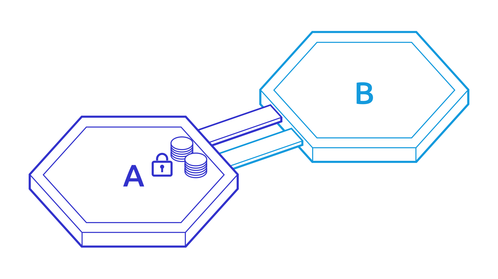
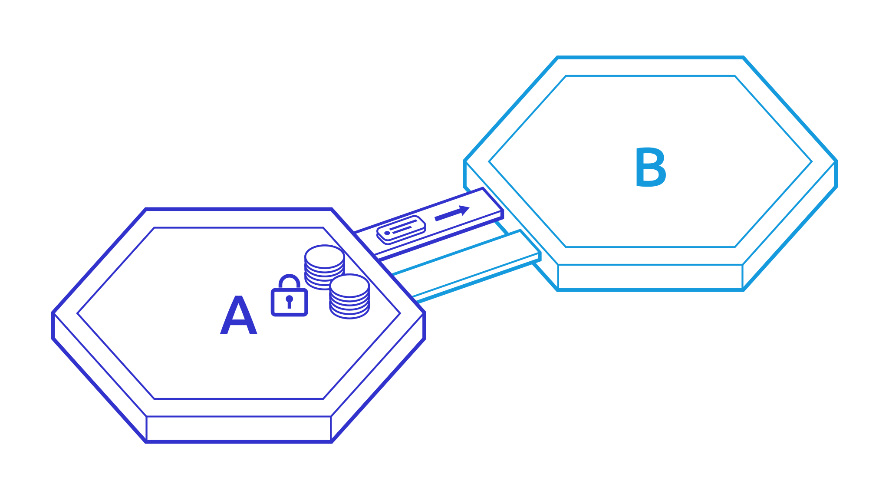
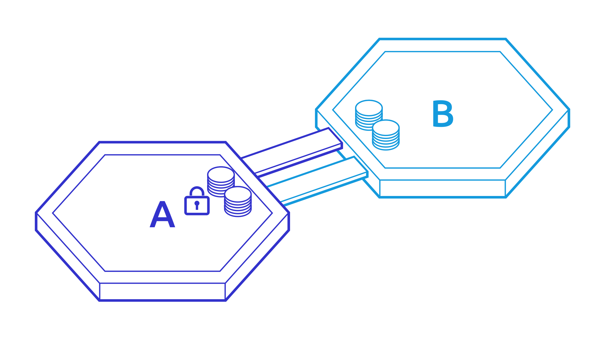

# Connecting Blockchains Together - IBC

Now that developers have a way to quickly build customized blockchains, let us see how to connect these blockchains together. The connection between blockchains is achieved through a protocol called [Inter-Blockchain Communication protocol](https://ibcprotocol.org) (IBC). IBC leverages the instant finality property of Tendermint consensus (although it can work with any “fast-finality” blockchain engine) to allow **heterogeneous chains to transfer value (i.e. tokens) or data to each other**.

#### WHAT ARE HETEROGENEOUS CHAINS? 

Essentially it comes down to two things:

* **Different layers:** Heterogeneous chains have different layers, meaning they can differ in how they implement the _networking_, _consensus_ and _application_ parts. To be compatible with IBC, a blockchain needs only follow a few requirements, the main one being that the _consensus_ layer must have fast finality. Proof-of-Work chains (like Bitcoin and Ethereum) do not fall in this category, as they have probabilistic finality.
* **Sovereignty:** Every blockchain is maintained by a set of validators whose job is to agree on the next block to commit to the blockchain. In Proof-of-Work blockchains these validators are called miners. A sovereign blockchain is a blockchain with its own validator set. In many instances it is important for blockchains to be sovereign, as validators are ultimately responsible for modifying the state. In Ethereum, applications are all run by a common set of validators. Because of this, each application only has limited sovereignty.

IBC allows heterogeneous blockchains to transfer tokens and data to each other, meaning that blockchains with different applications and validator sets are interoperable. For example, it allows public and private blockchains to transfer tokens to each other. Currently, no other blockchain framework enables this level of interoperability.

#### HOW IBC WORKS 

The principle behind IBC is fairly simple. Let us take an example where an account on chain A wants to send 10 tokens (let us call them&#x20;

ATOM) to chain B.

**Tracking**

Continuously, chain B receives the headers of chain A, and vice versa. This allows each chain to track the validator set of the other. In essence, each chain runs a&#x20;

light-client of the other.

**Bonding**

When the IBC transfer is initiated, the ATOM are locked up (

bonded) on chain A.

**Proof Relay**

Then, a proof that the 10 ATOM are bonded is relayed from chain A to chain B.

**Validation**

The proof is verified on chain B against chain A’s header and, if it is valid, then 10 ATOM-vouchers are created on chain B.&#x20;

