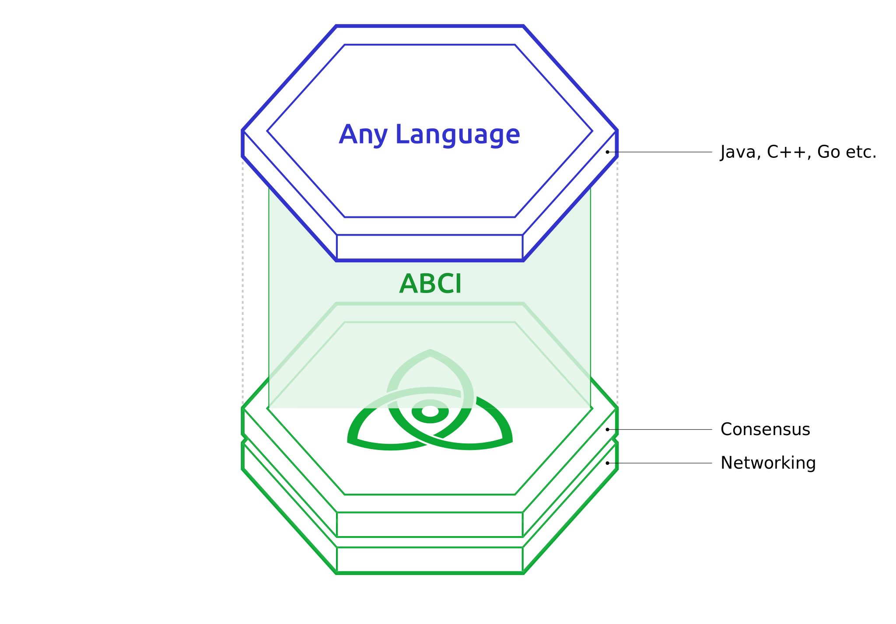

# What is Tendermint BFT and the ABCI ?

Until recently, building a blockchain required building all three layers (_Networking_, _Consensus_, and _Application_) from the ground up. Ethereum simplified the development of decentralized applications by providing a Virtual-Machine blockchain on which anyone could deploy custom logic in the form of Smart Contracts. However, it did not simplify the development of blockchains themselves. Much like Bitcoin, Go-Ethereum remains a monolithic tech stack that is difficult to fork from and customize. This is where Tendermint, created by Jae Kwon in 2014, came in.

Tendermint BFT is a solution that packages the networking and consensus layers of a blockchain into a generic engine, allowing developers to focus on application development as opposed to the complex underlying protocol. As a result, Tendermint saves hundreds of hours of development time. Note that Tendermint also designates the name of the byzantine fault tolerant (BFT) consensus algorithm used within the Tendermint BFT engine. For more on the history of consensus protocols and BFT you can check this cool podcast by Tendermint co-founder Ethan Buchman.

The Tendermint BFT engine is connected to the application by a socket protocol called the Application Blockchain Interface (ABCI). This protocol can be wrapped in any programming language, making it possible for developers to choose a language that fits their needs.

**But that is not all**. Here are the properties that make Tendermint BFT a state-of-the-art blockchain engine:

* **Public or private blockchain ready:** Tendermint BFT only handles _networking_ and _consensus_ for a blockchain, meaning that it helps nodes propagate transactions and validators agree on a set of transactions to append to the blockchain. It is the role of the _application_ layer to define how the validator set is constituted. **Developers can therefore build both public and private blockchains on top of the Tendermint BFT engine**. If the application defines that validators are elected based on how many tokens they have at stake, then the blockchain can be characterised as Proof-of-Stake (PoS). If however the application defines that only a restricted set of pre-authorized entities can be validators, then the blockchain can be characterised as permissioned or private. Developers have all the freedom to customize the rules that define how the validator set of their blockchain changes.
* **High Performance:** Tendermint BFT can have a block time on the order of 1 second and handle up to thousands of transactions per second.
* **Instant finality:** A property of the Tendermint consensus algorithm is instant finality. This means that forks are never created as long as more than a third of the validators are honest (byzantine). Users can be sure their transactions are finalized as soon as a block is created (which is not the case in Proof-of-Work blockchains like Bitcoin and Ethereum).
* **Security:** Tendermint consensus is not only fault-tolerant, it is also accountable. If the blockchain forks, [there is a way to determine liability](https://docs.tendermint.com/master/spec/light-client/accountability.html).
